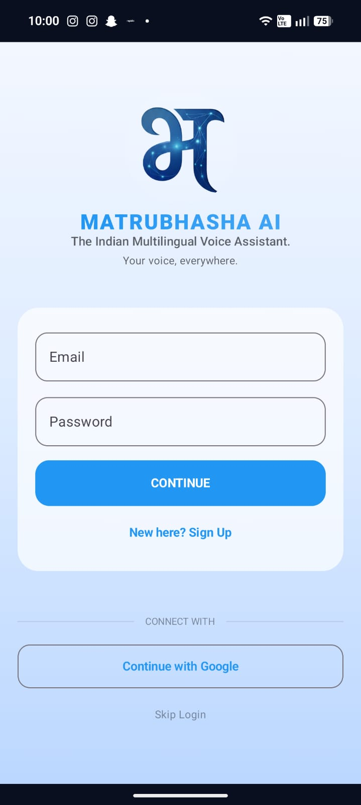

# Matrubhasha AI

Matrubhasha AI is a premium, multilingual Indian AI assistant application built with modern Android technologies. It leverages the **Sarvam AI** platform to provide context-aware, culturally relevant responses in multiple Indian languages, offering a seamless chat and voice experience.

## 🚀 Features

-   **Multilingual Intelligence**: Powered by the `sarvam-105b` model, providing accurate responses in several Indian languages.
-   **Voice-First Experience**: Integrated voice support for natural interactions.
-   **Smart Language Detection**: Automatically identifies the language being used using ML Kit.
-   **Premium UI/UX**:
    -   Modern **Jetpack Compose** interface with fluid animations.
    -   Dynamic **Dark & Light Mode** support.
    -   Glassmorphic cards and beautiful gradients.
-   **Secure Authentication**: Easy and secure login via **Firebase Google Authentication**.
-   **Personalized Settings**: Customize your experience by choosing preferred languages and themes.
-   **Persistent Chat**: Context-aware conversations that remember previous turns.

## 📸 Screenshots Gallery

### ☀️ Light Mode

| Login | Home Screen | Chat View | Voice Input |
| :---: | :---: | :---: | :---: |
|  |  |  |  |

| Settings | Language Select | Profile | About |
| :---: | :---: | :---: | :---: |
|  |  |  |  |

---

### 🌙 Dark Mode

| Login | Home Screen | Chat View | Voice Input |
| :---: | :---: | :---: | :---: |
|  |  |  |  |

| Settings | Language Select | Profile | About |
| :---: | :---: | :---: | :---: |
|  |  |  |  |

*Note: Replace these placeholders with actual screenshots from your device in a `screenshots/` directory.*

## 🛠️ Tech Stack

-   **Language**: Kotlin
-   **UI Framework**: Jetpack Compose (Material 3)
-   **Networking**: Retrofit & OkHttp
-   **AI Engine**: Sarvam AI API
-   **Backend/Auth**: Firebase (Authentication & Firestore)
-   **Local Storage**: SharedPreferences (via UserPreferences)
-   **Language Processing**: ML Kit Language ID
-   **Navigation**: Compose Navigation with smooth transitions

## ⚙️ Setup Instructions

### Prerequisites
- Android Studio Ladybug or later.
- A Firebase project with Google Sign-In enabled.
- A Sarvam AI API Key.

### Steps to Run
1. **Clone the repository**:
   ```bash
   git clone https://github.com/yourusername/multilang_AI.git
   ```
2. **Add Firebase**:
    - Place your `google-services.json` in the `app/` directory.
3. **Configure API Key**:
    - Open `app/build.gradle.kts`.
    - Replace the `SARVAM_API_KEY` value with your own key:
      ```kotlin
      buildConfigField("String", "SARVAM_API_KEY", "\"your_api_key_here\"")
      ```
4. **Sync Gradle**:
    - Let Android Studio download dependencies and sync the project.
5. **Run**:
    - Deploy the app to your physical device or emulator.

## 📂 Project Structure

-   `uiNav/`: Contains the main navigation logic and high-level screens (Home, Login, Settings).
-   `sarvam/`: Logic for interacting with the Sarvam AI API.
-   `voice/`: Voice management, TTS, and language detection components.
-   `ui/theme/`: Custom Material 3 theme, colors, and global styles.

---
Developed as a Major Project for empowering multilingual communication.
